# **Frontend Mentor - News homepage solution**

This is a solution to the [News homepage challenge on Frontend Mentor](https://www.frontendmentor.io/challenges/news-homepage-H6SWTa1MFl). Frontend Mentor challenges help you improve your coding skills by building realistic projects. 

# Table of contents

- [Overview](#overview)
  - [The challenge](#the-challenge)
  - [Screenshot](#screenshot)
  - [Links](#links)
- [My process](#my-process)
  - [Built with](#built-with)
  - [What I learned](#what-i-learned)
  - [Continued development](#continued-development)
  - [Useful resources](#useful-resources)
- [Author](#author)
- [Acknowledgments](#acknowledgments)

# Overview

## The challenge

Users should be able to:

- View the optimal layout for the interface depending on their device's screen size
- See hover and focus states for all interactive elements on the page

## Screenshot


## Links

- Solution URL: [Add solution URL here](https://your-solution-url.com)
- Live Site URL: [Add live site URL here](https://your-live-site-url.com)

## My process

To be completed

## Built with

- Semantic HTML5 markup
- CSS custom properties
- Flexbox
- CSS Grid
- Mobile-first workflow

# What I learned

- **What effective learning is.** For a long time I was struggling with getting elements to line up neatly with each other with the underlying grid to match the design. I ended up discovering that grid doesn’t apply to non-direct descendants. Later, I realised I already read this section in Comeau's CSS course[^1] but I completely forgot about it because I didn’t have to apply it anywhere. Indeed, I finished the grid problems in the course, but applying it to a complete projectl like this home page presented more problems and gaps in my understanding. It goes to show I need to asap get into a project and discover challenges and difficulties for myself, to truly understand how the properties work before a lesson gets through to me. It's as Sonke Ahrens talked about, I learn better when I struggle on my own first for a while and without being introduced because I'm forced to discover things for myself. The struggle is memorable. 

- The challenge of coding - once I fix one problem, another one pops up
- Learnt about the importance of semantics and accessibility
- How to use dev tools in browser throughout the coding process to test and check changes and help troubleshoot problems
- Browser actually updates automatically, it seems, without me having to save file and refresh page, saves time

### **Outstanding problems**

- menu for small widths and mobile
  - ⬜️ add slide in animation for hamburger menu to keep reader tied to context
  - ⬜️ background has a semi-transparent dark layer that overlays the rest of the content when menu is activated
      - how to restructure my html so the screen is sitting behind the expanded navigation and on top of everything else? 
      - mysterious white padding on the side
- ⬜️ Instead of adding a div with an empty divider bottom and adding unnecessary padding everywhere, try `<hr>` to provide visual break and divide content. These can be styled
- ⬜️ how to properly use svgs, is there a conventional way they need to be treated?
- check semantics Eg. I called the bottom stuff a section “other” but wonder if this is semantically the footer. Wonder if there might be better semantic alternatives for the elements I’ve used Like is there a `<desc>` tag? For each article desc instead of using `<p>`?
- ⬜️ Not sure why setting min-height for tablet media query doesn’t work it expands to be super huge … maybe something to do with `<picture>`?
- ⬜️ still don’t know how to target border-bottom on last child of the “new” sidebar … confusing myself with all the nested elements and selectors
- ⬜️ Think I’m dividing the grid incorrectly e.g. “New” link in nav seems to line up with edge of “New section” and “growth of gaming” article which makes me think there’s 12 columns instead of 3, 4 mini columns in each big 3 columns. But I don’t know how to break up the list so that “new” lines up perfectly with the other sections. how to adjust nav menu so “new” nav link lines up with “new” section and growth of gaming, they look very obviously aligned
- ⬜️ seems to target all children instead of just the first
    ```
    section.other a:first-child {
        margin-top: 0px;
    }
    ```
    But then for mobile, when I targeted only the last child in mobile it works
- ⬜️ other ways to target border-bottom on last child of the “new” sidebar … confusing myself with all the nested elements and selectors
- ⬜️ this weird thing happens: where the the images aren’t the same height cos they’re conforming to the height of the overall content . The pop lasts a short while, but it’s still noticeable. Not sure how to get it to fit the overall height of underlying grid
- **addressing responsive problems**
  - ⬜️ maybe nav needs to have flexible spacing in between too as we shrink the screen (while also keeping in line with underlying grid?)
  - ⬜️ not even sure which min width to set for mobile - desktop, the style guide says mobile: 375px and Desktop: 1440px
  - ⬜️ 150px wide is the smallest the screen can go - it ignores the padding I set around it and clips some of the content on the edges, not sure if I even need to try to fix for this cos realistically, who tries to view content on 150px … world’s smallest computer

    

    Also does this on tiny screens cos I didn’t set a fixed height
    

    Might try explore clamping again?? Also that tiny little gap at the end of growth of gaming looks annoying - space between would’ve fixed that but when new gets too long as the screen decreases, the space between the articles becomes really displeasing to the eye
- ⬜️ Just realised that the second picture in other section lines up with “read more” … I can’t seem to get the children in the flex box to only grow to a max third of the entire width of content-box. If takes width to be the column it’s confused to maybe I have no idea why the first flex child is given so much space when I specified the flex: 1 1 0px? I  know widths are suggestions in flex box but I don’t see how the content in first child is any different from the others? They’re both short … 
  I tried a contained version in codepen and it works as expected
  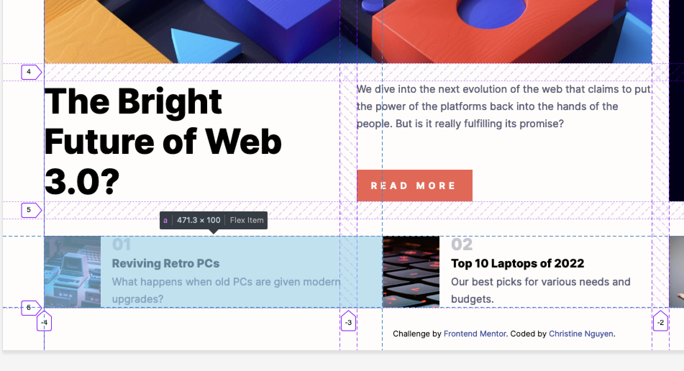
- ⬜️ fun animations and transitions to make the interactive elements look a bit more slick … it IS a tech news website after all 

### Final Checks

- Test accessibility for screen readers. REMEMBER: don’t need to have exact replica of experience every single time 
  - ⬜️ **keyboard users** (in Firefox, only “read more” is focusable, in edge - everything with links are focusable as expected, except for read more which is focusable twice I guess cos it’s both a button and a link … in which case would need to test how redundant having a link on button is). how to activate focusable styles
  - ⬜️ Read Sara soudeins article on setting up a testing environment for **screen readers**
  - ⬜️ go through Comeau's article on setting up local mobile environment
  - ⬜️ test website on older devices which cannot update browser to latest version to provide fallbacks
  - ⬜️ Learn about adding appropriate alts to images 
- ⬜️ test on differnt browsers (see above note on how Read more is focussable only in Firefox)
- ⬜️ whether the font is being correctly applied
- ⬜️ font weights
- ⬜️ what’s the actual font of the serif logo used in design mockup? Possible font families?
- ⬜️ double check measurements are ok. Right now I’m trying to keep spacing consistent around 24px without referring to Figma

### **Problems Addressed**

- ✅ Grid doesn’t seem to work properly with nested elements ie descendants, only direct children - elements are displaced if I try to put more children within the parent’s direct children.However, I need similar elements to be nested under a parent for semantic purposes. For example, to me, the mini articles at the bottom ("other" section) clearly look like they belong to a section given their similar layout. 

  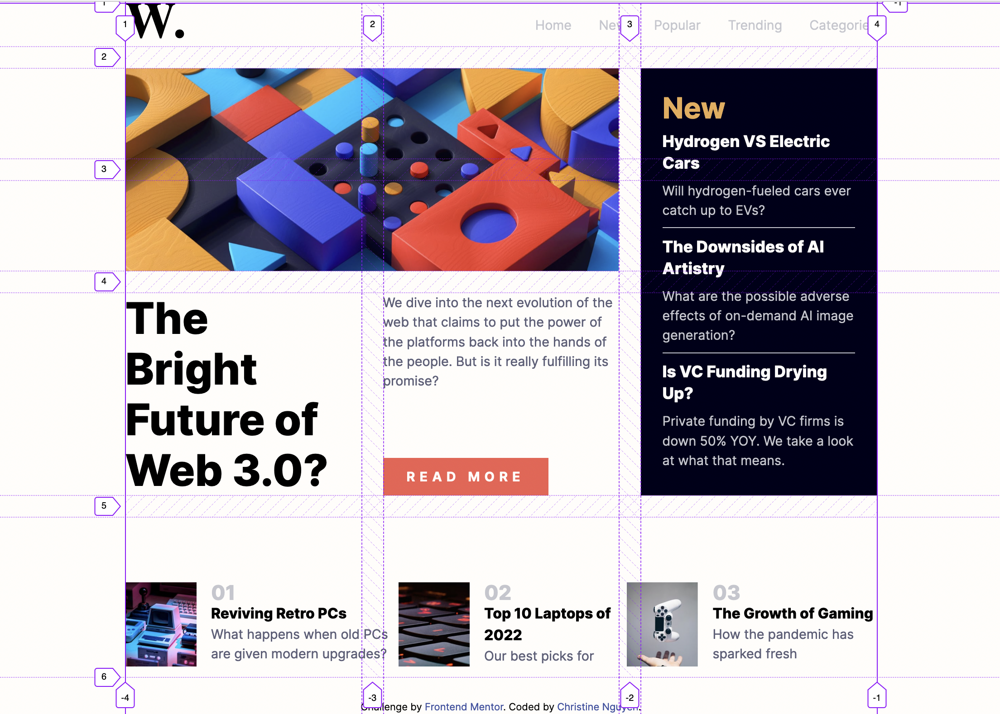

  Right now, to get elements to perfectly align in their own space in the underlying grid they need to be separated elements in the doc. 

  I could use flex instead of grid but not sure how to get the flex to adjust itself to the underlying grid - need to revisit on relationship between these 2 layouts. Or maybe I don’t, maybe I can just repeat a lot of times I dunno. But There has to be a simpler way of making the children fill out the length of each column without me specifying the grid column/row number of each and every child. Think I need to do more to understand grid algorithms.

  I've revisited Comeau's section on grid in his course and he actually does mention that indirect descendants (i.e. not direct children of the parent element to which grid property was applied) will NOT adhere to grid rules. This was noted in the “sub grid” section in Module 7 as an optional lesson because only Firefox supports the property at the moment.

  > The only way for elements to participate in the same CSS grid together (or flexbox for that matter) is for them to be siblings. So, in some cases we might be incentivized to forego HTML semantics for the benefit of layout (not great).” ~ via [Get Ready for `display: contents;` | CSS-Tricks - CSS-Tricks](https://css-tricks.com/get-ready-for-display-contents/)

  But in the meantime, how do I get the descendant to line up to grid by other means? 
  * Maybe it’s ok to have “other” use flex even if the alignment is slightly off. 
  * Maybe there’s no way around it, all children have to be on its own. Although it will be a problem when trying 

  SOLUTION: Game changer. Found out about `“display: contents”` from [Get Ready for `display: contents;` | CSS-Tricks - CSS-Tricks](https://css-tricks.com/get-ready-for-display-contents/). This neat tip negates the need for sub grid which only has limited browser support AND I can still keep things grouped for semantic’s sake - was very uncomfortable seeing my html doc with seemingly scattered child elements. 

The only thing is, because the containing element effectively “disappears”, anything like margin and padding settings are ignored, to fix that, I created an empty div to get the extra spacing as in design mock-up but not sure if this adds too much clutter to the html doc. 


✅ **Because I’ve set “new” section to flex for desktop and allowed the spacing to be determined by how much available space there is instead of setting a fixed padding and margin (I thought this was the best way to go because setting fixed measurements would mean awkward gaps would start appearing) - when the screen is smaller, there’s practically no space and everything appears squished which is differerent from the design mock-up**

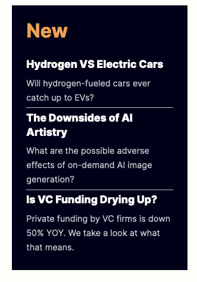

**SOLUTION** Influence the height of the image to help determine the height of this “new” section. Set height of image to at least 280px which helps spread out the elements in “new” section then grow from there to suit the size of the viewport - or until viewport reaches max 1200px

✅ JS: how to incorporate the hamburger menu at the top for mobile displays - how to interact with DOM

Le Wagon's warm up course got me up to speed fairly quickly.
```
// click on nav-expander button
// slide nav-expanded into view

document.querySelector(".nav-expander").addEventListener("click", () => {
    document.querySelector(".nav-expanded").classList.add("display");
})

// click on nav-close button
// slide nav-expanded out of view

document.querySelector(".nav-close").addEventListener("click", () => {
    document.querySelector(".nav-expanded").classList.remove("display");
})
```

✅ Fix spacing between elements in each of these, looks uneven… I’ve set them to flex and space between but might use fixed space after each number
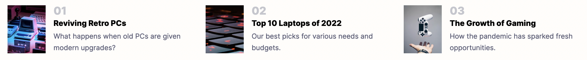

**Solution**: I've instructed the content to spread themselves out according to the height of the image. Instead of setting a fixed height, I set a fixed width and got rid of the height limit on the container which has helped a lot with spacing. This means I don’t have to deal with text overflow ellipsis for footer content (but would like to try this in the future) … it wasn’t working and I wasn’t sure alternative way we can use to get the full desc to show when the screen is too small and we can’t see any of the desc potentially get rid of the images? text overflow also got clipped too early cos I set max height of the container as well - cuts off ends of letters which have hanging tails or whatever…. Also may be too tiny for exceptionally large (tall) screens

This is the smallest width the screen can go to before it shifts to tablet format - they still look alright
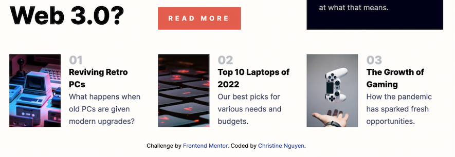

✅ don’t like the transition between 900px where it’s full screen to being in the centre - not smooth, jumpy
I’d like it to be so that there’s space slowly added on either side and then entire screen centred as we slowly expand the screen

I previously had another media query beyond desktop styles set to activate when width of viewport reached 1200px (arbitrary and temp number) which means the browser, which was full screen at 900px would immediately jump to contain .content in max-with: 75% 
Got rid of that media query, set desktop style to still change to 3 col format at min size 900px then set max-width of .content to 1280px so even if people are viewing it on a huge ass screen, it will never exceed this width. We get a smooth flowing transition 

✅ Sorta somewhat solved this by just making an empty div styled with border bottom, but this is a hack workaround

I needed the break to get the content to spread evenly with however tall the container is when the screen is re-sized using flex layout to minimise the gap leftover on the other cells for the main section
☑️ The trouble left is that when there is no space left, it will look super squished

✅ **creating responsive images when swapping between mobile and desktop for the main section**

Refer to Comeau’s Mod 6 “responsive images” section `<srcset>`. I’ve gotten it to work with source media, but will need to revisit this as I still don’t understand how to use it properly.

I used `<picture>` as this was easier for me to understand how to use which changed the image formatting dramatically 

```
  <picture>
    <source media="(max-width: 520px)" srcset="./assets/images/image-web-3-mobile.jpg" />
    <source media="(min-width: 520px)" srcset="./assets/images/image-web-3-desktop.jpg" />
    
  </picture>
```

Realised again the because the image is now nested inside picture, I needed to `display: contents` and set `height: 100%` for image inside to fill up available space as window is resized

But this meant the `<source media>` tags would also display as grid children and will take up space

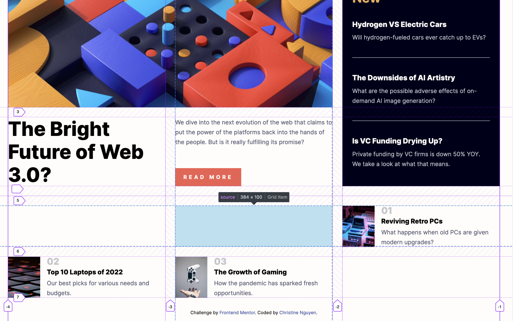

Set `source media` to `display: none;`

✅ **how to get the content inside “new” bar to space itself according to how tall the content is**

I’m using padding and margins but these are fixed measurements
Might be flex so I can use space-evenly or something
☑️ check on larger screen whether I’d need to use align-content/align items to get the content sitting in the middle of their containers cos the top spacing looks slightly different width to bottom 

✅ targeting the correct selector for different states in a complicated selector…or getting link to be a full block, but only making the change to a certain element when hover is activated (pretty proud of myself for not getting too confused) … but I think there’s probably a simpler way

✅ Not sure how to get the pic to fill the space of the grid as I minimise and max the size of grid without looking shit: 
Object-fit: cover;
height: 100%; 
But for mobile, the height needs to be set height otherwise the full pic will display as a tiny rectange: 
height: calc(100vw - 48px) - take viewport current width and subtract padding on either side - seems to work in making a perfect square

✅ problem: interesting thing that was happening when I was resizing was that the content at the top would get cut off
Html, body was set to height: 100%

But I redistributed to: 
```
html {
  height: 100%;
}

body {
  min-height: 100%;
}

.content {
  height: min-content;
}
```

What was happening was that for some reason the children exceeded the height of the body

Not sure if redundant though so will need to re-check

✅ At first I specified both column and row dimensions … row was written like repeat(5, 1fr) but this added unnecessary gaps around elements as the browser calculated on distributing space available between each row 

When I specified only the number of columns I wanted, each row fit around the height of the children perfectly, browser auto calculated how tall each row should be - wraps around children

✅ Around 600px, the grid layout looks awful - too much spacing around the elements:
- the “new” sidebar is too skinny
- I don’t like that the main content heading doesn’t line up with the desc and button
- too much spacing between desc and button on in-between screen sizing cos I applied flex space between which looks good on full-screen size
- the columns also ignore the 1fr rule I put on it and seems to be shrinking to min content it can fit. So for the first column it resides to the word “bright” or “future” which means the column ends up being larger than the other two

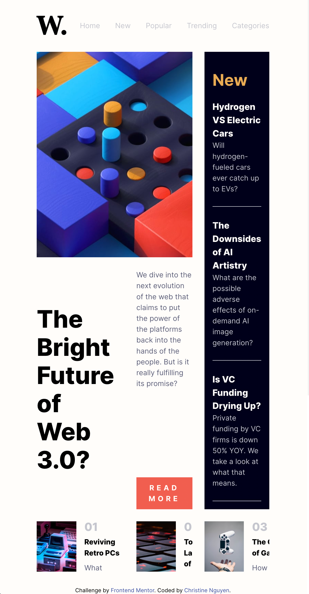

There needs to be a smooth transition between single grid layout then full 3 column grid layout
Unless I do another media query for a 2 column layout?
Could probably employ scroll bars for the bottom section but don’t think we can do that with grid cos the children aren’t contained in the same parent atm

**SOLUTION** - Even though a tablet mockup was not provided in the original Front End Mentor design folder, I decided to go with 2 column set up for the tablet version and the transition seems to flow much better. Quite happy with the way the nav disappears as soon as we get to mobile, which is when the links almost touch the logo, so it feels quite seamless. 

Moving to 2 column layout also gets rid of a slight overflow which briefly appears when re-sizing screen and approaching mobile layout. The content doesn’t resize as I pushed in on the left side of the screen but stayed static and then abruptly collapses to single column mobile layout.

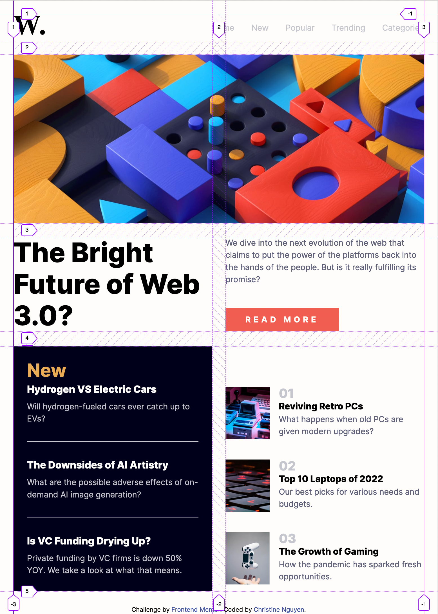

✅ Not sure where this mysterious gap underneath the logo here is coming from, even after I set line height to be the same as the font size, is it part and parcel of the font?

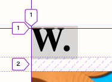

To be honest I didn't provide a solution for this. I just had this note which I don't understand: Don’t even need to worry about this cos the logo was provided as an svg anyways

✅  I forgot I can’t set 2 layout types … for example in Firefox if it supports sub grid then I’d want it to use that. But I’ve also got flex displayed. So it disables one in favour of the other - in this case it favours grid 

✅ ”read more” button clickable area goes beyond the button boundaries, I guess maybe the boundaries are only superficial
I previously had `<a>` wrapping the button tag to expand the clickable area … but then button actually fills up the entire width or block. so superficially, while it looked like we could only click on the red area, if we hovered over the block even outside the red area, the cursor pointer would still show, which is visually unexpected and a bit confusing
So I put `<a>` on only read more text itself and styled the link to look like a button and hid the actual semantic button … The button doesn’t look clickable so I needed to add a cursor: pointer, but a link IS clickable so I could get rid of the cursor
But had to apply display: flex to button for it to line up with the grid … display: block doesn’t do anything. Not sure why this is??

For some reason, the button seems to wrap when I set a relative value for padding. Here it was padding: 10px 10%; … I’m not sure what it’s trying to calculate 10% of … maybe button (it’s parent). And button has smaller width .. which Is a bit weird cos I thought button automatically spanned the entire width of its parent

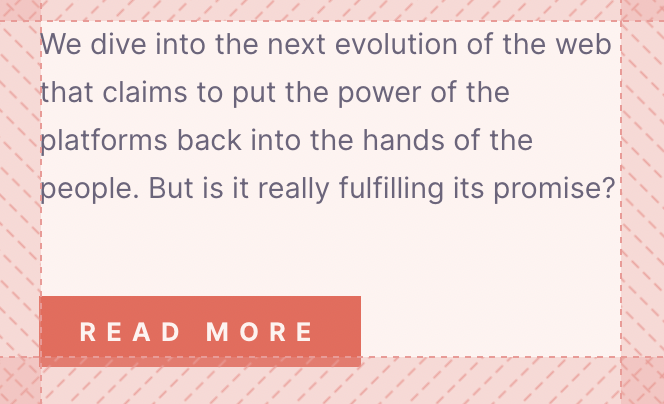
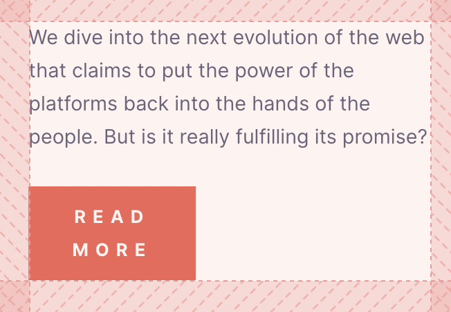
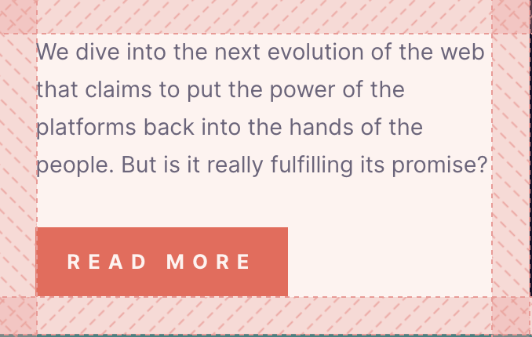 <- with display: flex

✅ try incorporating css variables esp for colours and wherever else applicable, easier to refer to instead of copying and pasting all the hsls  

## Continued development

Understanding how to use `<srcset>` for responsive images.

There's limitations with md formatting! I can't separate a bullet point or blockquote into multiple paragraphs. The task checkbox list `- [x]` doesn't work as expected. I cant get images to be in the middle rather than to left edge, but maybe md isn't meant for that?

Deeper understanding of grid required
- Go over Comeau’s module on grid (don’t think I finished it anyway)
- visit the official docs CSSWG
- Read articles from other experts

Still yet to try:
- [React](https://reactjs.org/) - JS library
- [Next.js](https://nextjs.org/) - React framework
- [Styled Components](https://styled-components.com/) - For styles

I am mindful that  Front End Mentor does not include opportunities for teamwork where the developer would be co-creating the final look of the product with the designer. Having beautiful design mockups ready for devs to code up eliminates a lot of work needed to learn a new discipline in design to get a good-looking project going to get technical skills up. However, this skimps out on the soft skills if the end goal is joining a larger team to develop a product.

> The conventional way to build software, "waterfall", was a multi-step process: first, design did all the user research and sketching and prototyping and creating high fidelity mockups. Once they were confident their work was finished, they'd toss it over the wall to the development team, and wouldn't hear anything about it until it was just about ready to go live.

> As I'm sure many people have experienced, this is not an ideal way to work. As developers, we have critical information needed for a successful design process. We know what data is and isn't available in our database. We understand the web platform and its limitations. In short, we know which ideas will be easy to implement, and which will be next-to-impossible. — Josh Comeau via [How to work effectively with designers and PMs](https://www.joshwcomeau.com/career/effective-collaboration/)

It's no easy task trying to find proper names for things to refer to particular parts of the website. I divided the website into different areas which are handled differently. I'm sure in a teamwork environment, I'd be borrowing the designer's names for these sections.

In future, if I want to learn something and for material to stay with me longer, I should try to code a tutorial for myself first. For example, if the aim of the tutorial is to make a tic-tac-toe game, I should dive straight in and try do it myself, cobbling together information from various sites and testing out stuff. And then when I'm satisfied I'll watch the tutorial as a way to compare methods and solutions.

Text overflow ellipsis for footer content

# Useful resources

- [^1][CSS for JS Developers](https://css-for-js.dev/) - I went through this course while working on this project alongside to immediately put lessons into effect.

## Author

- Website - [Add your name here](https://www.your-site.com)
- Frontend Mentor - [@yourusername](https://www.frontendmentor.io/profile/yourusername)
- Twitter - [@yourusername](https://www.twitter.com/yourusername)

## Acknowledgments

a hat tip to anyone who helped you out on this project. Perhaps you worked in a team or got some inspiration from someone else's solution. This is the perfect place to give them some credit.


Test
- [x]
- [ ]
- [ ]

